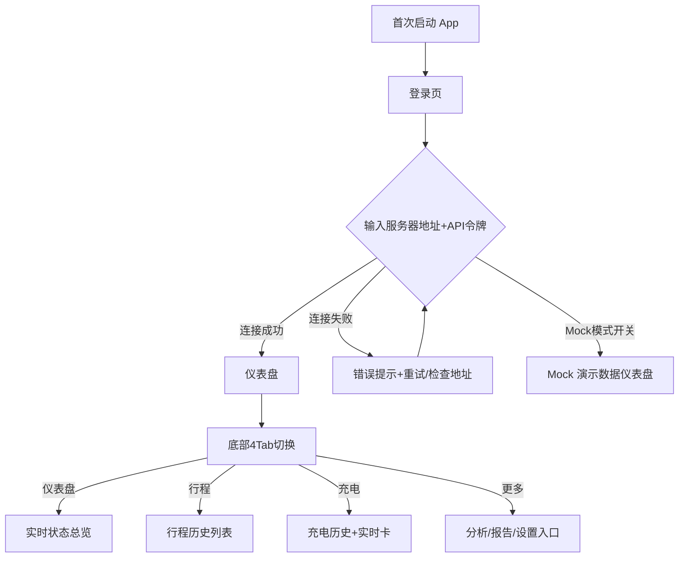
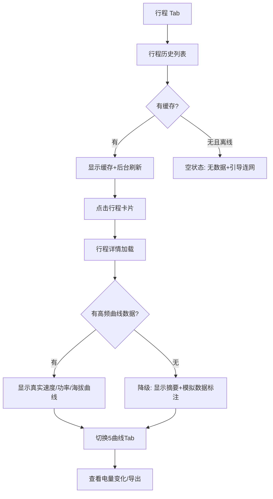
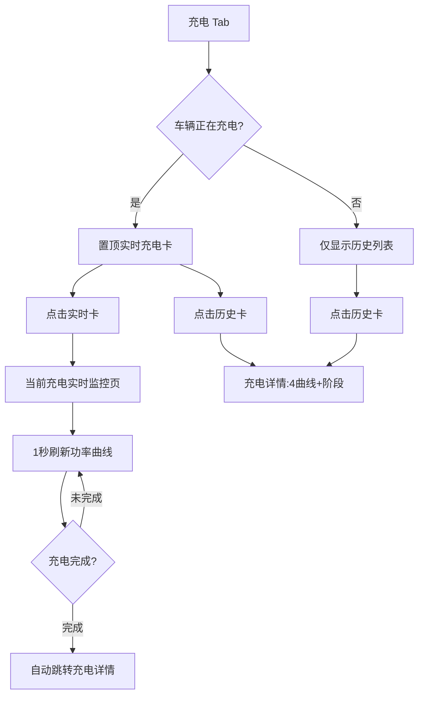

# Tesla MateLink 产品需求文档（落地版）

> **项目**：Tesla MateLink — TeslaMate 自托管移动端伴侣
> **版本**：v1.0 落地版（在概念版对齐后展开）
> **日期**：2026-07-02
> **作者**：Jovi（由 prd-writer skill 辅助生成）
> **依据**：融合原 `glm/` + `mimo/` 变体 PRD（2026-07-05 已整合归档并删除源文件）+ `MateLink_UI_PRD.md` + 工程实现
> **关联**：[概念版见对话记录] · [UI 交互详见 MateLink_UI_PRD.md](./MateLink_UI_PRD.md)

---

## 1. 产品概述

### 1.1 一句话定位

给**自托管 TeslaMate 的 Tesla 车主**用的**跨平台原生 App（iOS + Android + Web）**，帮他们在手机上以原生体验查看车辆全部历史与实时数据。核心差异：**数据主权 + 中国本地化 + 跨平台开源**。

### 1.2 产品形态

- **当前选型**：原生 App（iOS SwiftUI + Android Kotlin Compose）+ Web（React/Vite）+ Watch/Widget 配套
- **理由**：强依赖设备能力（地图/推送/Widget）+ 高频使用 + 跨平台一致 + 数据极客偏好原生
- **阶段策略**：v0.1-alpha 双端 + Web 原型就绪；Watch/Widget/AI 查询后续迭代

### 1.3 商业模式

Freemium：免费开源（MIT）+ 一次性 PRO 解锁（$9.99）。

| 功能 | 免费版 | PRO 版 |
|------|--------|--------|
| 实时仪表盘 / 行程充电历史 / 基础分析 | ✅ | ✅ |
| 多实例管理 / 高级分析（效率/续航/待机） / AI 查询 | ❌ | ✅ |
| Watch / Widget / 推送通知 | ❌ | ✅ |

---

## 2. 目标用户与使用场景

### 2.1 用户画像

| 画像 | 占比 | 特征 |
|------|------|------|
| 技术极客 | 50% | NAS/VPS/树莓派跑 TeslaMate，懂 Docker，看 Grafana，数据敏感 |
| 数据驱动型车主 | 30% | 想看电池衰减/充电效率/驾驶评分，不愿折腾 Grafana |
| 中国 Tesla 车主 | 15% | 上述任一 + 高德地图/分时电价/中文需求 |
| TeslaMate 新用户 | 5% | 刚装好，找手机客户端 |

**非目标用户**：没装 TeslaMate 的车主（引导先装）；要车控的用户（引导用官方 App）。

### 2.2 典型使用场景

**场景 1（技术极客·日常）**：张三早上出门前打开 MateLink，看仪表盘确认昨晚充满（80%），续航 312km。通勤到公司后，点开「行程详情」看这次 31km 的速度曲线和能耗 154 Wh/km，对比上月均值优化了 8%。

**场景 2（中国车主·充电）**：李四在公司用特斯拉超充，打开 MateLink 充电 Tab，置顶「正在充电」实时卡显示 78% + 7.4kW + 预计 21:45 完成。点击进入「当前充电」看功率曲线峰值 120kW，费用预估 ¥78。系统按分时电价谷段自动计算成本。

**场景 3（数据驱动·月度复盘）**：王五月底打开「更多 > 统计」，年份总览显示本月 1286km，点击月份钻取到月度详情，看日历热力图发现周末驾驶多。再点「成本分析」看本月充电习惯：家充占 64% 省了 ¥38，DC 快充占 33%，节约建议提示「改用谷段充电再省 ¥38」。

---

## 3. 核心用户动线

### 3.1 主流程：首次启动到查看数据



### 3.2 行程详情动线（含异常分支）



### 3.3 充电动线（含实时态）



---

## 4. 功能清单

```
Tesla MateLink
├── 🔴 实时仪表盘（核心，MVP 必须）
│   ├── 电池/续航/温度/胎压/车门状态
│   ├── 上次行程/上次充电快捷卡
│   ├── 7天电池趋势
│   └── 车辆状态栏（锁/哨兵/空调/连接）
├── 🔴 行程模块（核心，MVP 必须）
│   ├── 行程历史列表（Bento统计+分类Chip+可点击）
│   ├── 行程详情（地图+5曲线+6统计）
│   └── 按月切换/最近30天
├── 🔴 充电模块（核心，MVP 必须）
│   ├── 充电历史列表（AC/DC标记+电量条）
│   ├── 当前充电实时监控（功率曲线+预计完成）
│   ├── 充电详情（4曲线+充电阶段+月度习惯）
│   └── 月度摘要钻取成本分析
├── 🔴 多实例管理（核心，MVP 必须）
│   ├── 连接多个 TeslaMate 服务器
│   ├── 实例切换
│   └── 添加/编辑实例（L3）
├── 🔴 中国本地化（核心，差异化）
│   ├── 高德地图 + GCJ-02 转换（HK/Macau旁路）
│   ├── 分时电价 TOU 成本计算
│   └── 多语言（中/英/日/德/法）
├── 🟡 深度分析（重要，v1.0）
│   ├── 统计钻取（年→月→日→行程链）
│   ├── 效率分析（Golden Foot 评分）
│   ├── 电池健康（衰减+循环+温度）
│   ├── 成本分析（AC/DC+分时电价+习惯总结）
│   ├── 续航分析（预估vs实际+影响因素）
│   ├── 待机耗电（因素+趋势+优化建议）
│   ├── 时间线（24h活动轴）
│   ├── 热力图（15天×24小时）
│   ├── 目的地 Top20
│   └── 里程钻取
├── 🟡 报告与导出（重要，v1.0）
│   ├── 年度报告 PDF
│   ├── 数据导出 CSV/JSON
│   └── 固件版本历史
├── 🟡 设置与关于（重要，v1.0）
│   ├── 连接/显示/模拟模式设置
│   ├── 哨兵历史
│   └── 关于（技术栈/开源许可/功能矩阵）
├── ⚪ 跨端延伸（未来，v1.1+）
│   ├── Apple Watch App
│   ├── 桌面 Widget（Glance/WidgetKit）
│   └── 推送通知（充电完成/异常）
└── ⚪ AI 增强（未来，v2.0）
    ├── 自然语言查询（"上周哪天最费电"）
    └── 智能驾驶建议
```

---

## 5. 关键页面布局线框图

选取最核心的**仪表盘**（用户最常停留）和**充电历史**（含实时态断链修复）两个页面：

### 5.1 仪表盘（L1）

```
┌─────────────────────────────────────┐
│ Tesla Model 3      🟢在线           │  顶栏：标题+状态Chip
├─────────────────────────────────────┤
│  ┌──────────┐   ┌──────────────┐   │
│  │   ⊙ 78%  │   │   312 km     │   │  核心卡：电池环+续航
│  │   电池    │   │  预估续航    │   │  ← 视觉重心
│  └──────────┘   └──────────────┘   │
├─────────────────────────────────────┤
│ ┌─────────┐┌─────────┐            │
│ │📍31.2km ││⚡42kWh  │            │  2×2 信息网格
│ │上次行程  ││上次充电 │            │
│ └─────────┘└─────────┘            │
│ ┌─────────┐┌─────────┐            │
│ │🌡️24°C   ││🔒已锁   │            │
│ │车内温度  ││车门     │            │
│ └─────────┘└─────────┘            │
├─────────────────────────────────────┤
│ 🔒已锁 · 🛡️哨兵关 · ❄️空调关 · 🔌已连接 │  状态栏
├─────────────────────────────────────┤
│ 胎压  FL 2.5  FR 2.5  RL 2.4 RR 2.4 │  胎压卡
├─────────────────────────────────────┤
│ 7天电池趋势                          │
│ ▁▂▃▅▆█▅  ← 今天高亮                 │  趋势柱状图
├─────────────────────────────────────┤
│ [仪表盘][行程][充电][更多]           │  底部4Tab
└─────────────────────────────────────┘
```

### 5.2 充电历史（L1，含实时态置顶）

```
┌─────────────────────────────────────┐
│ ◀ 充电历史          📅2025年7月  ⚙️  │  顶栏
├─────────────────────────────────────┤
│ ┌──────────┐ ┌──────────┐          │
│ │284 kWh   │ │¥186.50   │          │  Bento统计
│ │总电量(金) │ │总费用    │          │
│ └──────────┘ └──────────┘          │
├─────────────────────────────────────┤
│ ┃🟢 正在充电  家充      78%       → │  置顶实时卡
│ ┃  7.4kW  预计21:45  +5.2kWh       │  （金色左竖线，
│ ┃  点击进入实时监控                  │   仅充电中显示）
├─────────────────────────────────────┤
│ ┃特斯拉超充站        +52.4 kWh 🟡  │  历史卡（DC橙竖线）
│ ┃ 12%━━━━━━━━━85%  42min           │
│ ┃7/5 14:20 [DC] 120kW  ¥78.60  →   │
├─────────────────────────────────────┤
│  家充              +38.5 kWh 🟡     │  历史卡（AC无竖线）
│  65%━━━━━100%  5h12m               │
│  7/1 18:30 [AC] 7.4kW  ¥9.25  →    │
├─────────────────────────────────────┤
│ [仪表盘][行程][充电][更多]          │  底部4Tab(充电高亮)
└─────────────────────────────────────┘
```

---

## 6. 功能详细描述

> 每个 🔴 核心功能单独一节。完整 20 页面布局见 [MateLink_UI_PRD.md](./MateLink_UI_PRD.md)。

### 6.1 实时仪表盘

**功能描述**：一屏掌握车辆实时状态，作为 App 启动默认页。

**触发条件**：App 启动 / 点击底部「仪表盘」Tab。

**交互细节**：

| 场景 | 交互处理 |
|------|---------|
| 操作反馈 | 下拉刷新显示转圈 + "已刷新"toast |
| 数据加载 | 骨架屏（电池环/数字占位灰块）|
| 危险操作 | 无危险操作 |
| 空状态 | 未连接实例时显示"请先添加 TeslaMate 实例" + 引导按钮 |
| 操作失败 | 离线显示缓存数据 + 灰色"离线"标签 + 重试按钮 |

**状态清单**：

| 状态 | 触发条件 | UI 表现 | 可执行操作 |
|------|---------|---------|-----------|
| 在线 | status 接口正常 | 绿色脉动点+"在线" | 查看详情 |
| 离线 | 网络异常 | 灰色"离线"+缓存数据 | 重试连接 |
| 睡眠中 | 车辆休眠 | "车辆休眠中"+上次数据 | 唤醒(官方App) |
| 加载中 | 首次拉取 | 骨架屏 | 等待 |
| 充电中 | plugged_in+charging | 电池环橙色+"充电中" | 点进当前充电 |

**边界条件**：
- 车辆休眠时：显示"车辆休眠中，显示的是 {N} 分钟前数据"
- 多车辆时：顶栏下拉切换车辆
- 胎压无数据：该卡显示"胎压数据不可用"
- 温度极值：-20°C 以下或 60°C 以上红色高亮 + 告警图标

**数据规范**：

| 字段名 | 类型 | 必填 | 来源 | 说明 |
|--------|------|------|------|------|
| battery_level | int | 是 | /status | 0-100 |
| est_battery_range_km | int | 是 | /status | 预估续航 |
| inside_temp_c | float | 否 | /status | 车内温度 |
| outside_temp_c | float | 否 | /status | 车外温度 |
| locked | bool | 是 | /status | 车门锁定 |
| sentry_mode | bool | 是 | /status | 哨兵模式 |
| is_climate_on | bool | 是 | /status | 空调 |
| plugged_in | bool | 是 | /status | 已连接充电 |
| tire_pressure_fl/fr/rl/rr | float | 否 | /status | 胎压 bar |
| last_drive_distance_km | float | 否 | /drives | 上次行程距离 |
| last_charge_kwh | float | 否 | /charges | 上次充电量 |

---

### 6.2 行程历史与详情

**功能描述**：浏览历史行程列表，点击进入含地图和多曲线的详情页。

**触发条件**：底部「行程」Tab / 仪表盘上次行程卡点击。

**交互细节**：

| 场景 | 交互 |
|------|------|
| 列表加载 | 骨架屏 3 卡占位 |
| 卡片点击 | scale-0.98 反馈 + 跳转行程详情 |
| 月份切换 | 顶栏日历图标，左右切换月，默认最近30天 |
| 筛选 | 类型(全部/通勤/旅行/出差) × 时间 |
| 高效标识 | 效率<155 Wh/km 显示绿色"高效"徽章带发光 |
| 空状态 | "暂无行程数据" + "检查 TeslaMate 是否在记录"引导 |

**状态清单**（行程卡片）：

| 状态 | 触发 | UI | 操作 |
|------|------|----|------|
| 默认 | 列表加载 | 完整卡片 | 点击进详情 |
| 加载中 | 拉取更多 | 底部转圈 | 等待 |
| 空状态 | 无数据 | 空插图+引导 | 检查 TeslaMate |
| 离线 | 无网络 | 缓存+离线标签 | 重试 |

**边界条件**：
- 行程极短（<1km/<2min）：标记"短途"不显示效率
- 行程超长（>500km）：日期格式显示完整时长
- 无高频曲线数据：详情页曲线区显示"模拟数据 — 基于行程摘要"
- 地图轨迹缺失：地图卡显示"路线轨迹不可用" + 起终点直线

**数据规范**：

| 字段名 | 类型 | 必填 | 说明 |
|--------|------|------|------|
| drive_id | string | 是 | 行程ID |
| start_address | string | 是 | 起点地址 |
| end_address | string | 是 | 终点地址 |
| distance_km | float | 是 | 距离 |
| duration_min | int | 是 | 时长 |
| start_date | datetime | 是 | 开始时间 ISO8601 |
| avg_speed_kmh | float | 否 | 均速 |
| max_speed_kmh | float | 否 | 最高速度 |
| consumption_kwh | float | 是 | 能耗 |
| efficiency_wh_per_km | float | 是 | 效率 |
| start_battery_pct | int | 否 | 起始电量 |
| end_battery_pct | int | 否 | 结束电量 |
| category | enum | 否 | 通勤/旅行/出差(自动标注) |
| route_polyline | string | 否 | 轨迹编码折线 |
| speed_curve[] | number[] | 否 | 速度曲线 |
| power_curve[] | number[] | 否 | 功率曲线 |
| elevation_curve[] | number[] | 否 | 海拔曲线 |
| inside_temp_curve[] | number[] | 否 | 车内温度曲线 |
| outside_temp_curve[] | number[] | 否 | 车外温度曲线 |

---

### 6.3 充电历史与实时监控

**功能描述**：浏览充电记录，充电中置顶实时卡，点击进详情或实时监控页。

**触发条件**：底部「充电」Tab。

**交互细节**：

| 场景 | 交互 |
|------|------|
| 实时卡显示 | 仅 `is_charging_now=true` 时置顶，金色左竖线+绿色脉动点 |
| 实时卡点击 | 跳转「当前充电」实时监控页 |
| 历史卡点击 | 跳转「充电详情」 |
| 摘要条点击 | 钻取「成本分析」 |
| 类型筛选 | 全部/AC/DC |
| DC标记 | 橙色左竖线 + 橙边框 DC Chip |
| 实时刷新 | 当前充电页 1 秒刷新功率曲线 |

**状态清单**（充电实时卡）：

| 状态 | 触发 | UI | 操作 |
|------|------|----|------|
| 充电中 | is_charging_now | 置顶金竖线卡+脉动点 | 点击进实时监控 |
| 未充电 | is_charging_now=false | 不显示实时卡 | 仅历史列表 |
| 即将完成 | pct>95 | "涓流充电，即将完成" | 等待 |
| 充电异常 | power=0 且 plugged_in | 红色"充电中断" | 检查连接 |

**边界条件**：
- 充电中网络断开：实时卡显示"实时数据中断"+最后功率+时间戳
- 充电时长超 12h：可能异常，显示"充电时长过长，请检查"
- 费用为 0：显示"未配置电价"+设置引导
- 功率异常低（<1kW 且 DC）：提示"充电速度异常，检查充电桩"

**数据规范**：

| 字段名 | 类型 | 必填 | 说明 |
|--------|------|------|------|
| charge_id | string | 是 | 充电ID |
| location_name | string | 是 | 充电地点 |
| address | string | 否 | 地址 |
| date | datetime | 是 | 充电时间 |
| charge_kwh | float | 是 | 充入电量 |
| start_battery_pct | int | 是 | 起始电量 |
| end_battery_pct | int | 是 | 结束电量 |
| duration_min | int | 是 | 时长 |
| charge_type | enum | 是 | AC/DC |
| power_kw | float | 否 | 平均功率 |
| cost_cny | float | 否 | 费用 |
| is_charging_now | bool | 是 | 是否正在充电 |
| power_realtime_curve[] | number[] | 否 | 实时功率曲线 |
| voltage_curve[] | number[] | 否 | 电压曲线 |
| temp_curve[] | number[] | 否 | 温度曲线 |
| soc_curve[] | number[] | 否 | SOC 曲线 |
| charge_phase | enum | 否 | cc/cv/trickle |

---

### 6.4 多实例管理

**功能描述**：连接多个 TeslaMate 服务器（家/公司），快速切换。

**触发条件**：设置 > 实例 / 首次启动登录页。

**交互细节**：

| 场景 | 交互 |
|------|------|
| 添加实例 | 「+ 添加实例」→ L3 添加实例页 |
| 切换实例 | 实例列表点击，圆点选中态 |
| 测试连接 | 「测试连接」按钮，显示"连接中..."→"成功/失败" |
| 删除实例 | 长按实例 → 二次确认弹窗"删除实例 {name}？" |
| 活跃实例 | 绿色"活跃"Chip + ✓ |

**状态清单**（实例项）：

| 状态 | 触发 | UI | 操作 |
|------|------|----|------|
| 活跃 | 当前选中 | 绿色"活跃"Chip+✓ | 切换其他 |
| 可用 | 连接测试成功 | 圆点选择器 | 点击切换 |
| 不可达 | 连接失败 | 红色"不可达"+地址 | 编辑/删除 |
| 测试中 | 点击测试连接 | "连接中..."转圈 | 等待 |

**边界条件**：
- 服务器地址非 HTTPS 且非 LAN：UrlSecurity 阻断 + "公网 HTTP 不安全"提示
- API 令牌错误：401 提示"令牌无效"
- 服务器版本不兼容：提示"TeslaMate 版本过低，建议升级到 v1.30+"
- 同时多个实例切换：缓存数据隔离，切换时刷新

**数据规范**：

| 字段名 | 类型 | 必填 | 长度 | 默认 | 校验 |
|--------|------|------|------|------|------|
| instance_id | string | 是 | uuid | - | - |
| name | string | 是 | 1-50 | - | 非空 |
| server_url | string | 是 | ≤200 | - | HTTPS 或 LAN IP |
| api_token | string | 是 | ≤200 | - | 非空 |
| is_active | bool | 是 | - | false | - |
| last_connected | datetime | 否 | - | - | - |

---

### 6.5 中国本地化

**功能描述**：高德地图 + GCJ-02 坐标转换 + 分时电价 + 多语言。

**触发条件**：地图渲染 / 成本计算 / 语言设置。

**交互细节**：

| 场景 | 交互 |
|------|------|
| 地图渲染 | 国内用高德，海外用 Leaflet/OSM，自动判断 |
| HK/Macau 旁路 | 港澳地区保留 WGS-84，不转 GCJ-02 |
| 电价配置 | 设置 > 分时电价，配置峰/平/谷时段和单价 |
| 成本计算 | 按充电时段分段累加 |
| 语言切换 | 跟随系统 / 中文 / English / 日本語 / Deutsch / Français |

**边界条件**：
- 坐标转换误差：GCJ-02 转换用测试向量 `shared/gcj02_test_vectors.json` 验证，误差 < 5m
- 港澳判断：按地址行政区划，非坐标判断（避免边界抖动）
- 电价未配置：费用显示"未配置电价"+设置引导
- 多语言缺翻译：fallback 到英文 + 标记待翻译

**数据规范**：

| 字段名 | 类型 | 必填 | 说明 |
|--------|------|------|------|
| latitude | float | 是 | 原始 WGS-84 纬度 |
| longitude | float | 是 | 原始 WGS-84 经度 |
| is_china_mainland | bool | 是 | 是否中国大陆（决定坐标转换）|
| tou_periods[] | array | 否 | 分时电价时段 [{start,end,price}] |
| tou_price_peak | float | 否 | 峰段单价 ¥/kWh |
| tou_price_flat | float | 否 | 平段单价 |
| tou_price_valley | float | 否 | 谷段单价 |
| language | enum | 是 | zh-CN/en/ja/de/fr |

---

## 7. 文案规范

### 7.1 产品整体文案风格

**专业严谨 + 简洁直接**（数据极客向工具产品）。
- 不用感叹号、不用卖萌语气
- 数字优先于描述（"续航 312km"优于"续航还不错"）
- 错误提示说明原因 + 下一步
- 单位一律带（km/kWh/°C/bar/¥）

### 7.2 面向终端用户的产品文案

| 场景 | 文案 | 备注 |
|------|------|------|
| 页面标题 | 仪表盘 / 行程历史 / 充电历史 | 简洁名词 |
| 在线状态 | 在线 / 离线 / 车辆休眠中 | 状态+原因 |
| 空状态(行程) | 暂无行程数据 / 检查 TeslaMate 是否在记录 | 标题+引导 |
| 空状态(充电) | 暂无充电记录 / 连接 TeslaMate 后自动同步 | 标题+引导 |
| 按钮(主) | 保存 / 测试连接 / 立即安装 / 导出 | 动词开头 |
| 按钮(危险) | 停止充电 / 清空历史 / 删除实例 | 红色，动词 |
| 成功提示 | 已保存 / 连接成功 / 导出完成 | 正向简短 |
| 错误(连接) | 连接失败，请检查服务器地址和网络 | 原因+下一步 |
| 错误(令牌) | API 令牌无效，请重新输入 | 原因+下一步 |
| 错误(超时) | 请求超时，请检查网络后重试 | 原因+下一步 |
| 加载中 | 正在加载... / 同步中... | 让用户知道在工作 |
| 危险确认 | 确认删除实例 {name}？此操作不可撤销 | 说清后果 |
| 充电完成 | 充电完成，已充入 {N} kWh | 正向+数据 |
| 离线提示 | 当前离线，显示缓存数据 | 状态+原因 |

### 7.3 面向开发的字段说明

见第 6 章各功能「数据规范」表格，技术侧准确优先，已在功能描述中覆盖。

---

## 8. 非功能性需求

### 8.1 性能

| 指标 | 要求 |
|------|------|
| 首屏加载 | < 2s（缓存命中）/ < 3s（冷启动）|
| 接口响应 | < 500ms（LAN）/ < 2s（远程）|
| 列表滚动 | 60fps，无卡顿 |
| 图表渲染 | < 300ms |
| 实时充电刷新 | 1 秒/次，无明显闪烁 |
| 离线打开 | < 1s（缓存）|

### 8.2 安全

- **数据存储**：API 令牌用 EncryptedSharedPreferences(Android) / Keychain WhenUnlockedThisDeviceOnly(iOS)
- **网络**：network_security_config.xml + UrlSecurity 运行时守卫（HTTPS 或 LAN，阻断公网 HTTP）
- **不收集用户数据**：App 直连用户 TeslaMate，不经任何第三方服务器
- **开源可审计**：MIT 协议，代码公开

### 8.3 兼容性

| 平台 | 最低版本 |
|------|---------|
| Android | 8.0 (API 26) |
| iOS | 15.0 |
| Web | Chrome 90+ / Safari 14+ / Firefox 88+ |
| TeslaMate | v1.30+ |
| TeslaMateApi | v1.x+ |

### 8.4 数据存储

- 缓存保留：行程/充电数据 90 天
- 离线缓存：最近 30 天数据
- Mock 模式：内置演示数据，离线开发用
- 日志：不记录用户数据，仅技术错误日志（可关闭）

### 8.5 无障碍

- WCAG AA：对比度 4.5:1+（白色主题 16:1）
- 字体大小：支持系统字体缩放
- 屏幕阅读：VoiceOver/TalkBack 支持
- 色盲友好：状态不依赖颜色，辅以图标/文字

---

## 9. 待确认问题

- [ ] **L3 统计-日详情页**是否纳入 v1（原型已有，开发是否同步）——影响统计钻取链完整性
- [ ] **AI 自然语言查询**优先级——v1.1 还是 v2.0，影响 PRO 定价策略
- [ ] **Apple Watch 独立性**——独立查数据还是依赖手机，影响 v1.1 工作量
- [ ] **PRO 定价区域化**——中国区是否单独定价（$9.99 在中国偏高）
- [ ] **3D 车辆展示**——是否保留为 v1 差异化，还是延后（Three.js 包体积大）
- [ ] **车控命令 v2.0**——是否支持，依赖 Owner API，有封号风险

---

## 10. 版本记录

| 版本 | 日期 | 变更 |
|------|------|------|
| v1.0 概念版 | 2026-07-02 | 初版概念对齐 |
| v1.0 落地版 | 2026-07-02 | 整合 glm/mimo PRD + UI-PRD，按 prd-writer skill 落地版结构输出 |

---

> **说明**：本 PRD 是整个工程的总纲，整合现有 `glm/`(9份) + `mimo/`(2份) + `MateLink_UI_PRD.md`。
> - **功能/技术/数据模型细节**：见 [glm/](./glm/) 9 份分文档
> - **UI 视觉/页面布局/跳转逻辑**：见 [MateLink_UI_PRD.md](./MateLink_UI_PRD.md)（20 页面详细需求）
> - **本文档**：工程级总纲，定方向、定边界、定核心功能规格
